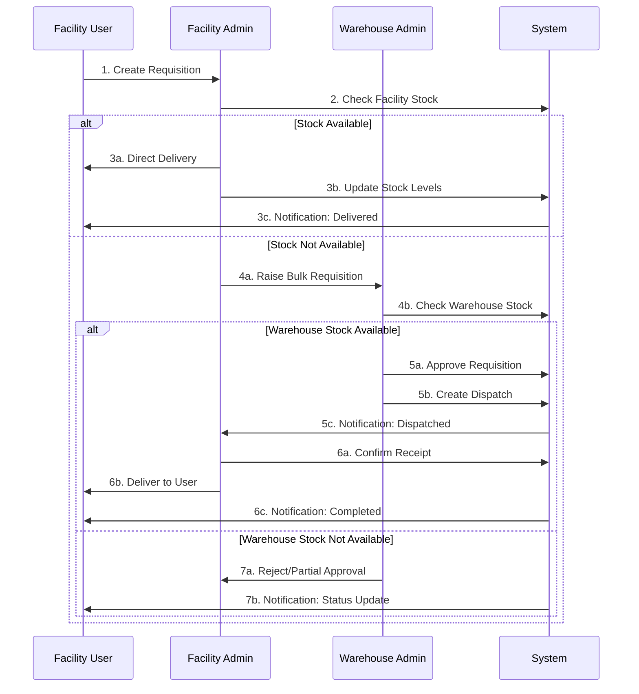
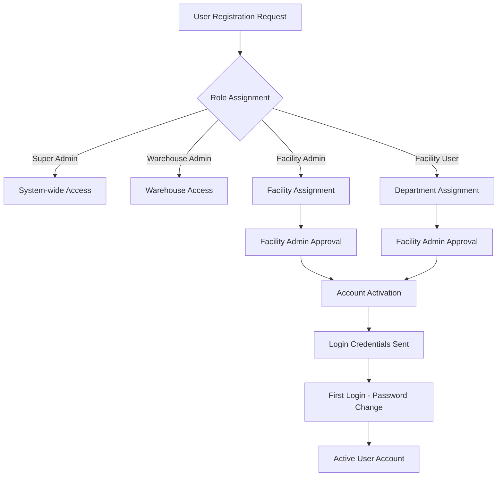
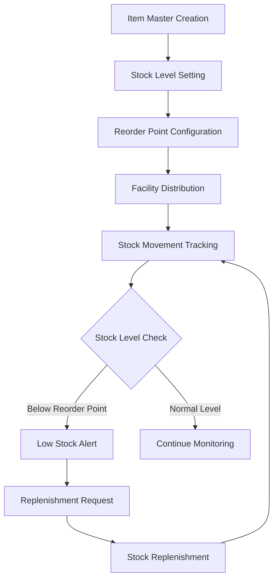
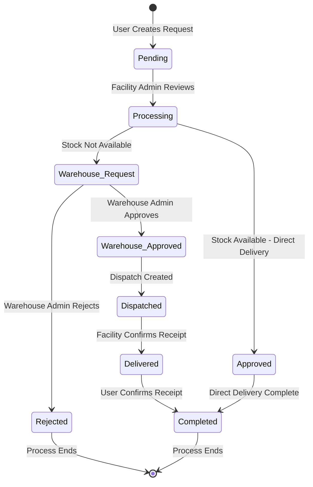
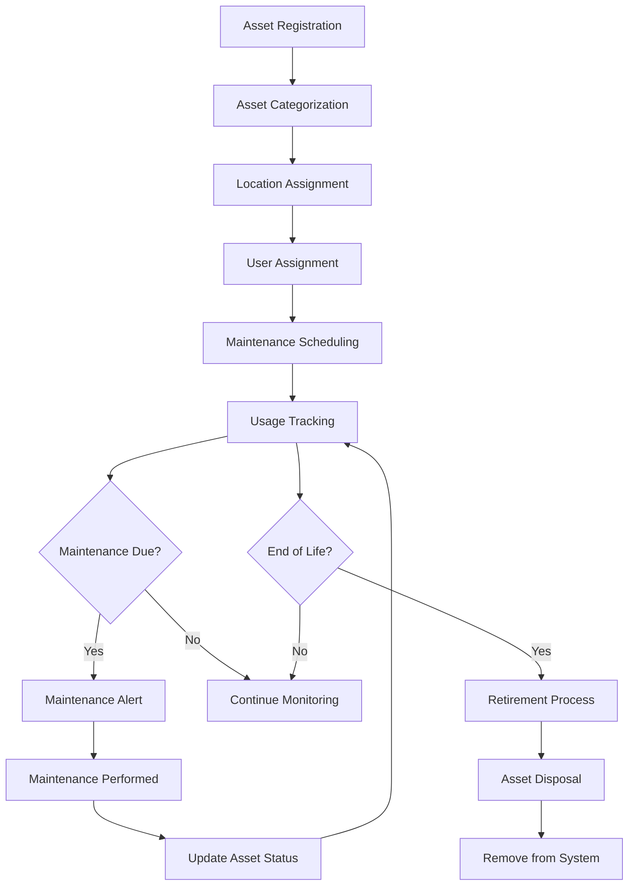
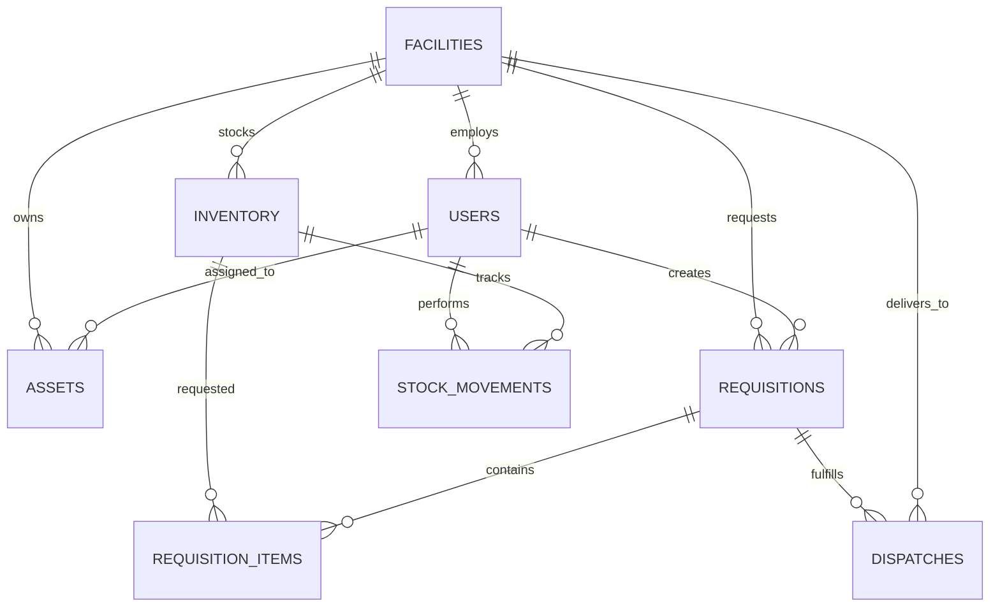
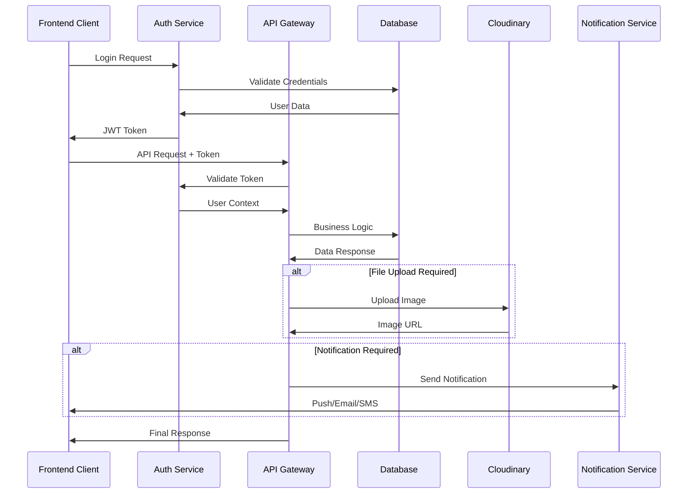
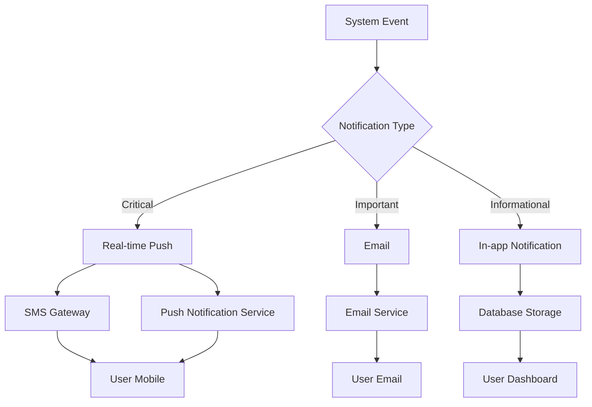
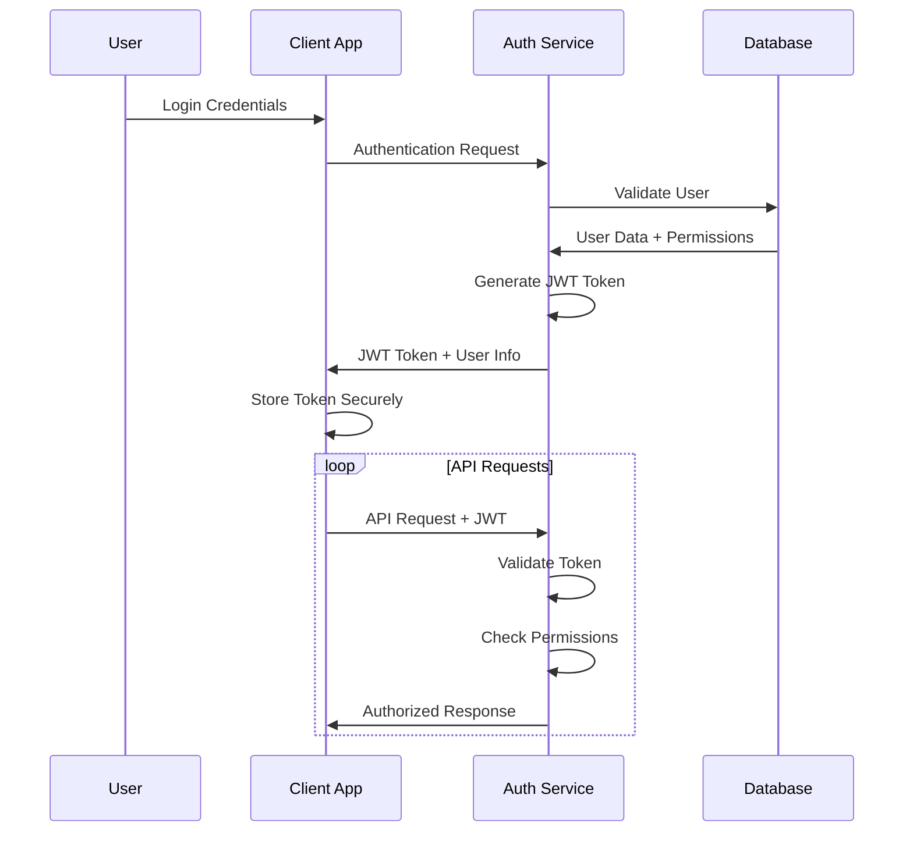

# Hospital Inventory Management System - Software Flow Documentation

## Table of Contents

1. [System Overview](#system-overview)
2. [User Roles and Responsibilities](#user-roles-and-responsibilities)
3. [Complete System Flow](#complete-system-flow)
4. [Module-wise Detailed Flows](#module-wise-detailed-flows)
5. [Database Relationships](#database-relationships)
6. [API Integration Points](#api-integration-points)
7. [Business Rules and Logic](#business-rules-and-logic)
8. [Notification System](#notification-system)
9. [Security and Access Control](#security-and-access-control)
10. [Reporting and Analytics](#reporting-and-analytics)

## System Overview

The Hospital Inventory Management System is designed to streamline the entire supply chain process within healthcare facilities. It manages the flow of medical supplies, equipment, and pharmaceuticals from central warehouses to individual facilities and ultimately to end users (doctors, nurses, staff).

### Core Objectives

- **Centralized Control**: Super Admin oversees the entire system
- **Efficient Distribution**: Warehouse manages stock and fulfills facility requests
- **Local Management**: Facilities handle day-to-day operations and user requests
- **User Convenience**: End users can easily request needed items
- **Audit Trail**: Complete tracking of all inventory movements
- **Cost Control**: Prevent overstocking and stockouts

## User Roles and Responsibilities

### 1. Super Admin (System Administrator)

**Primary Responsibilities:**
- System-wide oversight and control
- Facility management and configuration
- User management across all facilities
- Global inventory monitoring
- System settings and permissions
- Comprehensive reporting and analytics

**Key Capabilities:**
- Create, update, and deactivate facilities
- Manage users across all facilities and roles
- Override any workflow decisions when necessary
- Access all data and generate system-wide reports
- Configure system settings and business rules
- Monitor system performance and usage

**Typical Daily Tasks:**
- Review system-wide KPIs and alerts
- Approve new facility registrations
- Resolve escalated issues from facilities
- Generate executive reports
- Monitor user activity and system health

### 2. Warehouse Admin (Central Supply Manager)

**Primary Responsibilities:**
- Central warehouse inventory management
- Facility requisition approval and fulfillment
- Dispatch creation and tracking
- Supplier relationship management
- Stock level optimization

**Key Capabilities:**
- Manage warehouse stock levels and reorder points
- Approve or reject facility requisitions
- Create dispatches for approved requisitions
- Track delivery status and resolve issues
- Generate warehouse performance reports
- Manage warehouse assets and equipment

**Typical Daily Tasks:**
- Review pending facility requisitions
- Approve/reject requests based on stock availability
- Create and track dispatches
- Monitor low stock alerts and reorder items
- Coordinate with suppliers for stock replenishment
- Generate daily dispatch and inventory reports

### 3. Facility Admin (Department Manager)

**Primary Responsibilities:**
- Facility-level inventory management
- User requisition processing
- Warehouse communication and coordination
- Local asset management
- Staff supervision and training

**Key Capabilities:**
- Manage facility inventory and stock levels
- Process user requisitions (approve/deliver)
- Raise bulk requisitions to warehouse when needed
- Confirm receipt of warehouse dispatches
- Manage facility users and their permissions
- Handle facility assets and equipment

**Typical Daily Tasks:**
- Review and process user requisitions
- Check facility stock levels and availability
- Raise bulk requests to warehouse for low stock items
- Confirm receipt of incoming dispatches
- Deliver items to requesting users
- Update inventory levels and generate facility reports

### 4. Facility User (End User - Doctors, Nurses, Staff)

**Primary Responsibilities:**
- Request needed medical supplies and equipment
- Confirm receipt of delivered items
- Report any issues or discrepancies
- Follow proper requisition procedures

**Key Capabilities:**
- Create requisitions for needed items
- Track status of personal requests
- View available facility inventory
- Receive notifications about request updates
- Confirm receipt of delivered items

**Typical Daily Tasks:**
- Submit requests for needed supplies
- Check status of pending requests
- Receive and confirm delivered items
- Report any quality issues or shortages

## Complete System Flow

### End-to-End Requisition Process

### Key Process Stages

1. **Request Initiation**: User identifies need and creates requisition
2. **Local Processing**: Facility Admin checks local availability
3. **Fulfillment Decision**: Direct delivery or warehouse request
4. **Warehouse Processing**: Approval, stock allocation, dispatch creation
5. **Delivery Confirmation**: Receipt verification and final delivery
6. **Completion**: User confirmation and inventory updates

## Module-wise Detailed Flows

### 1. User Management Flow

**Process Details:**
- New user requests are created by authorized personnel
- Role-based approval workflow ensures proper access control
- Facility-specific users require facility admin approval
- First login forces password change for security
- User status tracking (active, inactive, suspended)

### 2. Inventory Management Flow

**Key Features:**
- Centralized item master with facility-specific stock
- Automatic reorder point monitoring
- Real-time stock movement tracking
- Multi-level approval for stock adjustments
- Audit trail for all inventory changes

### 3. Requisition Workflow

**Status Definitions:**
- **Pending**: Awaiting facility admin review
- **Processing**: Under review by facility admin
- **Approved**: Approved for direct delivery from facility stock
- **Warehouse_Request**: Escalated to warehouse for fulfillment
- **Warehouse_Approved**: Approved by warehouse admin
- **Dispatched**: Items shipped from warehouse
- **Delivered**: Items received at facility
- **Completed**: Items delivered to end user
- **Rejected**: Request denied (with reason)

### 4. Asset Management Flow

**Asset Lifecycle Stages:**
- **Registration**: Initial asset entry with specifications
- **Assignment**: Location and user assignment
- **Active Use**: Regular monitoring and maintenance
- **Maintenance**: Scheduled and emergency maintenance
- **Retirement**: End-of-life processing and disposal

## Database Relationships

### Core Entity Relationships

### Key Relationships Explained

1. **Facilities ↔ Users**: Each facility has multiple users, users belong to one facility
2. **Inventory ↔ Facilities**: Items can exist in multiple facilities with different quantities
3. **Requisitions ↔ Users**: Users create requisitions, tracked by user and facility
4. **Stock Movements**: Complete audit trail of all inventory changes
5. **Assets ↔ Assignments**: Assets assigned to facilities and optionally to specific users

## API Integration Points

### External System Integrations

1. **Supplier Systems**: For automated purchase orders and stock updates
2. **Financial Systems**: For cost tracking and budget management
3. **Hospital Information Systems**: For patient-specific supply tracking
4. **Maintenance Systems**: For asset maintenance scheduling
5. **Notification Services**: For SMS/email alerts

### Internal API Workflows

## Business Rules and Logic

### Inventory Rules

1. **Stock Levels**: Cannot go below zero
2. **Reorder Points**: Automatic alerts when stock falls below threshold
3. **Expiry Management**: FIFO (First In, First Out) for perishable items
4. **Batch Tracking**: Lot numbers for pharmaceutical items
5. **Reserved Stock**: Items allocated to pending requisitions

### Approval Rules

1. **Requisition Limits**: Users may have quantity limits per request
2. **Priority Handling**: Urgent requests processed first
3. **Budget Controls**: Spending limits per department/facility
4. **Seasonal Adjustments**: Stock levels adjusted for seasonal demand
5. **Emergency Override**: Super Admin can override any restriction

### Workflow Rules

1. **Status Progression**: Requisitions must follow defined status flow
2. **Timeout Handling**: Automatic escalation for delayed approvals
3. **Partial Fulfillment**: Handling of partial approvals and deliveries
4. **Return Process**: Procedure for returning unused/damaged items
5. **Audit Requirements**: All changes must be logged with user and timestamp

## Notification System

### Notification Types

1. **Real-time Alerts**: Critical stock levels, urgent requests
2. **Daily Summaries**: Pending approvals, delivery confirmations
3. **Weekly Reports**: Stock levels, usage patterns
4. **Monthly Analytics**: Performance metrics, cost analysis

### Notification Channels

### Notification Rules

- **Escalation**: Unread critical notifications escalate to higher authority
- **Frequency Control**: Prevent notification spam with intelligent batching
- **User Preferences**: Users can customize notification preferences
- **Delivery Confirmation**: Track notification delivery and read status

## Security and Access Control

### Authentication Flow

### Permission Matrix

| Feature | Super Admin | Warehouse Admin | Facility Admin | Facility User |
|---------|-------------|-----------------|----------------|---------------|
| View All Facilities | ✅ | ✅ | ❌ | ❌ |
| Manage Users | ✅ | ❌ | ✅ (Facility Only) | ❌ |
| Approve Requisitions | ✅ | ✅ (Warehouse) | ✅ (Facility) | ❌ |
| Manage Inventory | ✅ | ✅ (Warehouse) | ✅ (Facility) | ❌ (View Only) |
| Create Requisitions | ✅ | ✅ | ✅ | ✅ |
| Generate Reports | ✅ | ✅ (Limited) | ✅ (Facility) | ✅ (Personal) |
| Manage Assets | ✅ | ✅ (Warehouse) | ✅ (Facility) | ❌ (View Only) |

### Data Security Measures

1. **Encryption**: All sensitive data encrypted at rest and in transit
2. **Access Logging**: Complete audit trail of all data access
3. **Session Management**: Secure session handling with timeout
4. **Input Validation**: Comprehensive validation of all inputs
5. **SQL Injection Prevention**: Parameterized queries and ORM usage
6. **File Upload Security**: Virus scanning and file type validation

## Reporting and Analytics

### Dashboard Views by Role

#### Super Admin Dashboard
- System-wide KPIs and metrics
- Facility performance comparison
- User activity and engagement
- Financial summaries and cost analysis
- System health and performance metrics

#### Warehouse Admin Dashboard
- Warehouse stock levels and movements
- Pending facility requisitions
- Dispatch tracking and delivery status
- Supplier performance metrics
- Demand forecasting and trends

#### Facility Admin Dashboard
- Facility inventory status
- User requisition queue
- Delivery confirmations needed
- Asset status and maintenance alerts
- Department-wise usage patterns

#### Facility User Dashboard
- Personal requisition status
- Available facility inventory
- Recent deliveries and confirmations
- Notification center
- Quick request shortcuts

### Report Types

1. **Operational Reports**:
   - Daily stock movements
   - Pending requisitions summary
   - Delivery confirmations
   - Low stock alerts

2. **Analytical Reports**:
   - Usage trends and patterns
   - Cost analysis by department
   - Supplier performance
   - Demand forecasting

3. **Compliance Reports**:
   - Audit trails
   - Regulatory compliance
   - Expiry tracking
   - Asset maintenance records

4. **Executive Reports**:
   - System performance metrics
   - Cost savings achieved
   - User adoption rates
   - ROI analysis

### Data Export Options

- **CSV**: For spreadsheet analysis
- **PDF**: For formal reporting
- **JSON**: For system integration
- **Excel**: For advanced analysis
- **Real-time API**: For dashboard integration

This comprehensive flow documentation provides a complete understanding of how the Hospital Inventory Management System operates, from high-level business processes to detailed technical implementations. The system is designed to be scalable, secure, and user-friendly while maintaining complete audit trails and regulatory compliance.